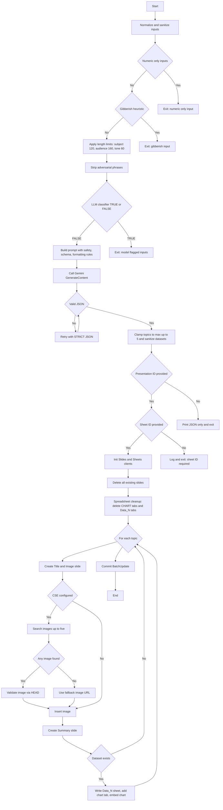

### Edge Cases and Guardrails (QA Flowchart)

### QA Edge Cases and Expected Outcomes

- **Numeric-only subject/audience/tone**: CLI exits with error. No model call.
- **Gibberish (heuristic)**: CLI exits with error. No model call.
- **LLM classifier TRUE**: CLI exits with error. No generation.
- **Length over limits**: Inputs are truncated (subject=120, audience=160, tone=60). Generation proceeds.
- **Prompt-injection phrases present**: Phrases are stripped; prompt includes safety note. Generation proceeds.
- **Non-JSON model output**: One retry with “STRICT JSON” reminder; on success, proceed; otherwise exit with parse error.
- **Topics > max**: Truncated to `--max` (≤5).

### Slides and Sheets behavior to test

- **Full slide wipe**: All existing slides are deleted up front. Expect only newly generated slides in strict order per topic (Title+Image → Summary → Chart).
- **Spreadsheet cleanup**: Deletes CHART tabs and any `Data_` tabs; ensures at least one grid sheet remains. Per-topic write clears `A:Z` before writing values.

### Image search and fallback cases

- **CSE unset or empty results**: Use fallback image URL; if fallback unreachable, skip image.
- **Invalid image URL (non-HTTPS or broken)**: HEAD check fails → use fallback image URL.
- **Fallback URL**: Defaults to a valid HTTPS placeholder; override with `--default-image-url` or `DEFAULT_IMAGE_URL`.
- **Param variations**: QA may vary `imgSize`, `imgType`, `imgColorType`, `imgDominant`, `img-rights`, `img-safe` and confirm request formation (max 5 results).

### Required IDs and client setup

- **Missing `--sheet-id` when `--presentation-id` is set**: Log and exit after printing JSON.
- **No credentials** (`GOOGLE_APPLICATION_CREDENTIALS` unset): Log and exit after JSON.
- **Impersonation optional**: If set but unauthorized, expect an auth error; if unset, service account is used.

### Known transient/service edge cases
- **Classifier 429/RESOURCE_EXHAUSTED**: One backoff retry (~350ms). On repeated failure, log warning and continue generation.
- **Slides/Sheets transient 429/5xx**: Surface error; QA may simulate to verify error logging and no partial state outside slide wipe step.

